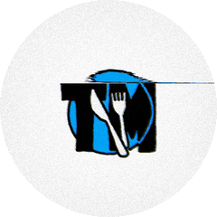

 

<em>Tools, workflows, and software across hospitality, nonprofits, security, gaming, and more.</em>

&nbsp;&nbsp;&nbsp;&nbsp;

 

&nbsp;
&nbsp;
&nbsp;
&nbsp;
&nbsp;
&nbsp;
&nbsp;

## What I Build

- **Published Game** 
  [*System.Execute*](https://store.steampowered.com/app/4353080) on Steam. Electron app with full Steamworks SDK integration.

- **Security Tools** 
  [Am I Hacked?](https://github.com/TMHSDigital/Am-I-Hacked) - open-source, zero-dependency Windows security scanner. Maps findings to MITRE ATT&CK and produces an interactive HTML report.

- **Homelab** 
  Raspberry Pi 5 running 15+ self-hosted services, managed entirely from Windows with Ansible and Docker. Tooling: [Home-Lab-Developer-Tools](https://github.com/TMHSDigital/Home-Lab-Developer-Tools).

- **Dev Tools** 
  Plugins and MCP servers for AI-assisted development, cataloged in [Developer-Tools-Directory](https://github.com/TMHSDigital/Developer-Tools-Directory), including [Docker](https://github.com/TMHSDigital/Docker-Developer-Tools), [Steam](https://github.com/TMHSDigital/Steam-Cursor-Plugin), [Blender](https://github.com/TMHSDigital/Blender-Developer-Tools) and [screencast-mcp](https://github.com/TMHSDigital/screencast-mcp).

## Tech

## Metrics & Activity

<b>[ View Dashboard ]</b>

 

  
    
  
    
  
    
  

If my work is useful to you, you can <a href="https://github.com/sponsors/TMHSDigital">sponsor it on GitHub</a>.

---
